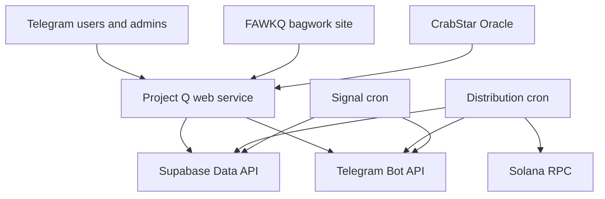

# Architecture

## Boundaries

## Components

- `src/server.js`: Express entry point, health/version routes, Telegram webhook,
  bagwork webhook, Oracle campaign event ingress, and command routing.
- `src/lib/`: Telegram, Supabase, Solana, XP, bagwork, signal, event, menu, and
  administration services.
- `src/campaign/`: Bond the Duck state, registry, service, ingest, and UI logic.
- `jobs/distribute.js`: value-moving FAWKQ SOL distribution workflow. It must
  fail closed and is disabled unless `PROJECT_Q_DISTRIBUTIONS_ENABLED=true`.
- `jobs/postSignal.js`: scheduled Telegram signal publisher. It is disabled
  unless `PROJECT_Q_SIGNALS_ENABLED=true`.
- `supabase/migrations/`: ordered production schema changes.
- `render.yaml`: desired production web/cron infrastructure. Direct-created
  services must be reconciled deliberately rather than assumed managed.

## Trust boundaries

- Telegram updates require the configured webhook secret.
- Bagwork events require the bagwork shared secret and are validated server-side.
- Oracle campaign events require a timing-safe shared-secret comparison and
  an idempotent database RPC.
- Supabase secret/service-role credentials belong only on server-side Render
  services. They must never use public-client prefixes or ship to browsers.
- Wallet secrets belong only on the distribution cron. The web service and
  signal cron do not need them.
- Telegram numeric IDs are authoritative; usernames are display metadata.

## Data ownership

The shared Supabase `Oracle` project currently stores both Oracle and Project Q
tables. Repository migrations and live migrations must be reconciled before a
release. The database and Render deployment state supersede conversation
history when determining production status.
